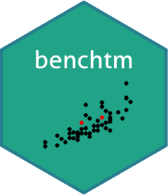

<!-- README.md is generated from README.Rmd. Please edit that file -->

# Project Title: Develop `{benchtm}` R-Package

### <font color = 'red'> This package is under development </font>

## Project Description:

<table>

<colgroup>

<col width="79%" />

<col width="20%" />

</colgroup>

<tr>

<td align="left">

<h3>

The <code>{benchtm}</code> aims to generate simulated data sets of
heterogeneous treatment effects in clinical trials for benchmarking
quantitaive methods.

</h3>

</td>

<td align="center">



</td>

</tr>

</table>

<hr />

<!-- badges: start -->

<!-- badges: end -->

## Installation

You can install the released version of `{benchtm}` with:

``` r
# This Package is under development.
# install_package('')
```

## Analytics/AMDS Subgroup Initiative link

  - [Yammer
    Page](https://www.yammer.com/novartis.com/#/threads/inGroup?type=in_group&feedId=15922028544&view=all)

## User guides:

Under Develpment ….

## Core Team Members

  - [Bjoern Bornkamp](mailto:bjoern.bornkamp@novartis.com)
  - [Sun Sophie](mailto:sophie.sun@novartis.com)
  - [Ardalan Mirshani](mailto:ardalan.mirshani@novartis.com)

## Developers

  - [Sun Sophie](mailto:sophie.sun@novartis.com)
  - [Ardalan Mirshani](mailto:ardalan.mirshani@novartis.com)

## Maintainer and contact

  - [Ardalan Mirshani](mailto:ardalan.mirshani@novartis.com)
